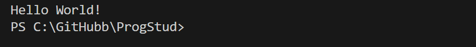

# Прог. Лабораторная работа №0

## Заданиe

* Создайте репозиторий для дисциплины на GitHub.
* Склонируйте его себе на ПК.
* Напишите свою первую программу.
* Запустите её.
* Сделайте коммит и пуш.
* Напишите отчёт в README.md. Отчёт должен содержать:
  * Задание
  * Описание проделанной работы
  * Консольные команды
  * Скриншоты результатов
  * Ссылки на используемые материалы

### Результат работы программы

Самая базовая,знакомая всем команда,для вывода сообщения "Hello World"

Начало для успешной сдачи "Программирования" положенно 😊
