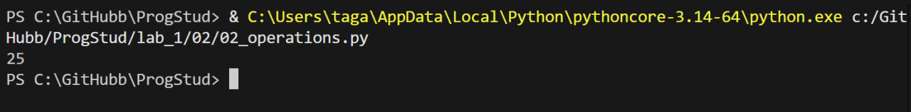

# Задание 2

## Описание задания

Расставьте знаки операций "плюс", "минус", "умножение" и скобки
между числами "1 2 3 4 5" так, что бы получилось число "25".

## описание работы

$$ ((1 + 2) \times 3 - 4) \times 5 $$

## результат работы программы

## Список использованных источников

1. [MarkDown](https://doka.guide/tools/markdown/ "Документация по Mark Down")
2. [Python](https://docs.python.org/3/search.html?q= "Документация по Python")
3. [Readme example](https://github.com/still-coding/report_demo "Пример для оформления работы")
