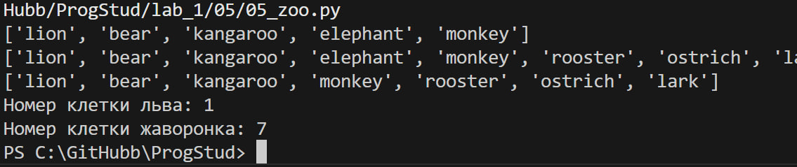

# Задание 5

## Описание задания

есть список животных в зоопарке.Посадите медведя между львом и кенгуру.Добавьте птиц из списка в последние клетки зоопарка.Уберите слона.Выведите на консоль в какой клетке сидит лев и жаворонок.

## описание работы

В ходе работы были использованны следующии команды:

```python
zoo.insert(1,"bear")
zoo += birds
zoo.remove("elephant")
```

## результат работы программы



## Список использованных источников

1. [MarkDown](https://doka.guide/tools/markdown/ "Документация по Mark Down")
2. [Python](https://docs.python.org/3/search.html?q= "Документация по Python")
3. [Readme example](https://github.com/still-coding/report_demo "Пример для оформления работы")
