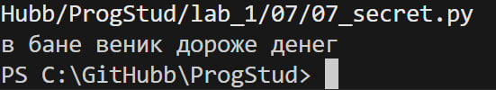

# Задание 7

## Описание задания

Необходимо расшифровать сообщение из списка

```python
secret_message = [
    'квевтфпп6щ3стмзалтнмаршгб5длгуча',
    'дьсеы6лц2бане4т64ь4б3ущея6втщл6б',
    'т3пплвце1н3и2кд4лы12чф1ап3бкычаь',
    'ьд5фму3ежородт9г686буиимыкучшсал',
    'бсц59мегщ2лятьаьгенедыв9фк9ехб1а',
]
```

## описание работы

С помощью срезов вытаскиваем необходимые куски строк и выводим их

## результат работы программы



## Список использованных источников

1. [MarkDown](https://doka.guide/tools/markdown/ "Документация по Mark Down")
2. [Python](https://docs.python.org/3/search.html?q= "Документация по Python")
3. [Readme example](https://github.com/still-coding/report_demo "Пример для оформления работы")
