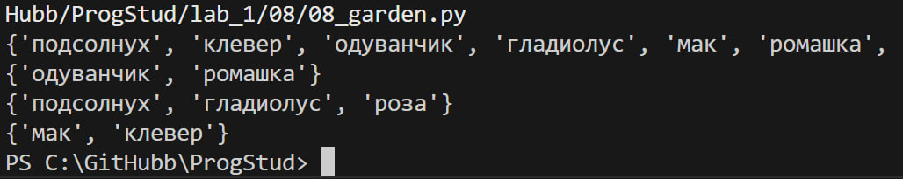

# Задание 8

## Описание задания

Есть множество цветов в саду.Есть множество цветов на лугу.
Выведите на консоль все виды цветов,выведите на консоль те, которые растут и там и там,вывидите на консоль те, которые растут в саду, но не растут на лугу,выведите на консоль те, которые растут на лугу, но не растут в саду.

## описание работы

Необходимые действия с множествами цветов:

```python
#все виды
result = garden_set | meadow_set
print(result)

#те, которые растут и там и там
print(garden_set & meadow_set)
# те, которые растут в саду, но не растут на лугу
print(garden_set - meadow_set)
# те, которые растут на лугу, но не растут в саду
print(meadow_set - garden_set)
```

## результат работы программы



## Список использованных источников

1. [MarkDown](https://doka.guide/tools/markdown/ "Документация по Mark Down")
2. [Python](https://docs.python.org/3/search.html?q= "Документация по Python")
3. [Readme example](https://github.com/still-coding/report_demo "Пример для оформления работы")
