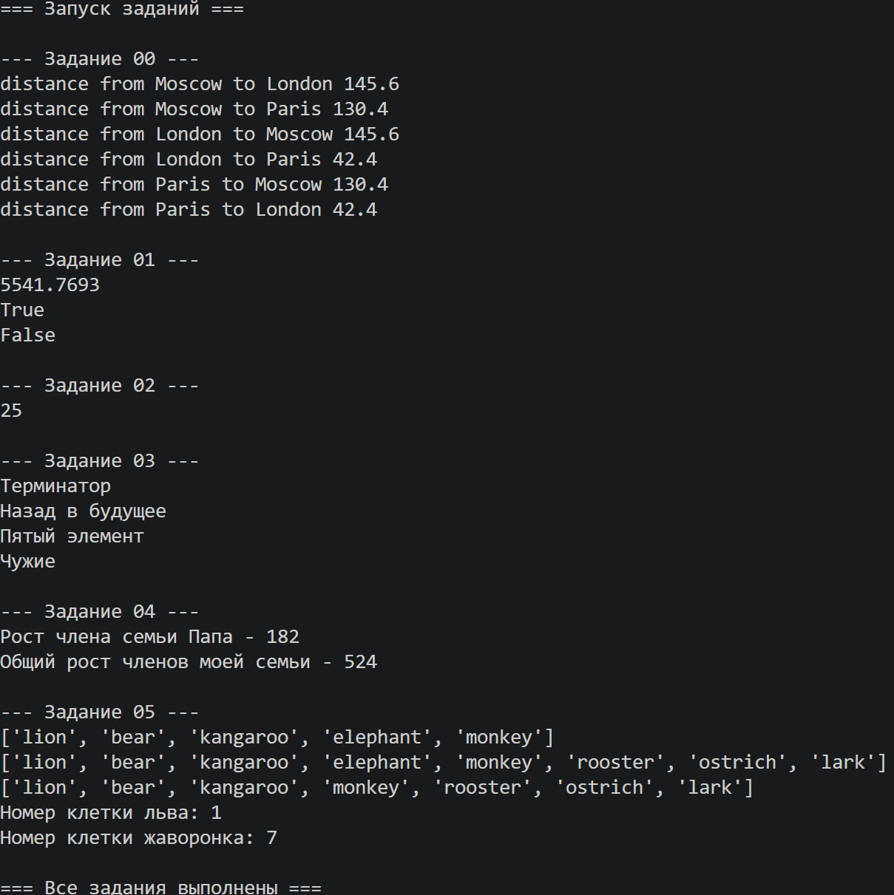

# Medium

## Описание задания

Напишите верхнеуровневый модуль, который будет использовать логику 
из модулей-заданий. Перед этим нужно будет придумать способ 
инкапсулировать логику для корректного импортирования.

## описание работы

В файле main.py реализована следующая логика:
Импорт всех шести модулей-заданий
Последовательный вызов функции run() каждого модуля
Вывод результатов на консоль

Пример для заданий 1 и 2

```python
# Задание 00: расчёт расстояний между городами
    print("--- Задание 00 ---")
    _00_distance.run()
    print()
    
    # Задание 01: площадь круга и проверка точек
    print("--- Задание 01 ---")
    _01_circle.run()
    print()
```

## результат работы программы



## Список использованных источников

1. [MarkDown](https://doka.guide/tools/markdown/ "Документация по Mark Down")
2. [Python](https://docs.python.org/3/search.html?q= "Документация по Python")
3. [Readme example](https://github.com/still-coding/report_demo "Пример для оформления работы")
