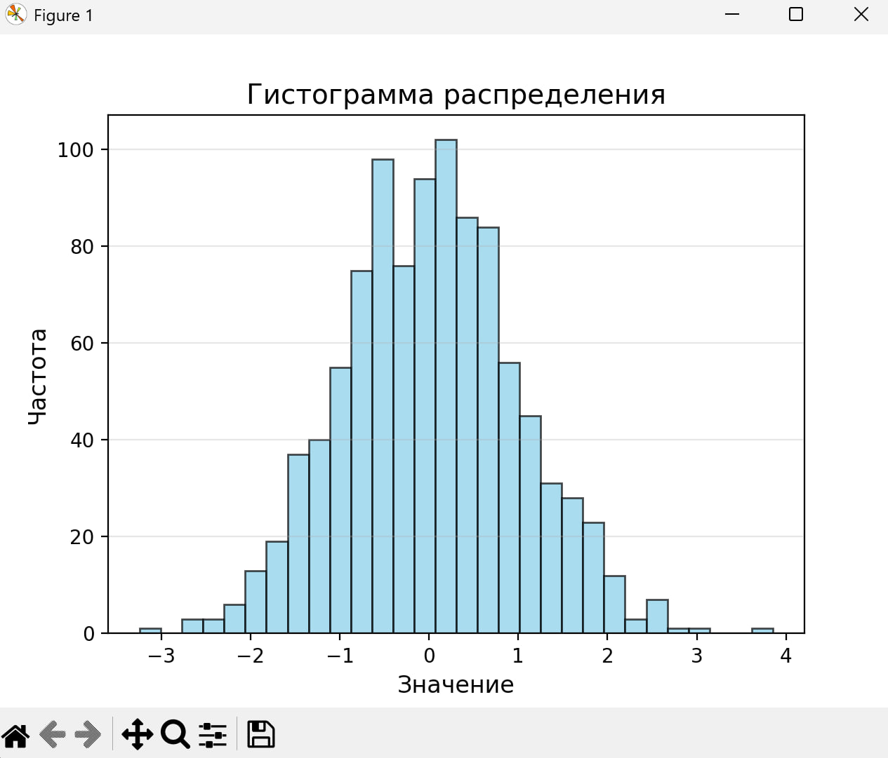
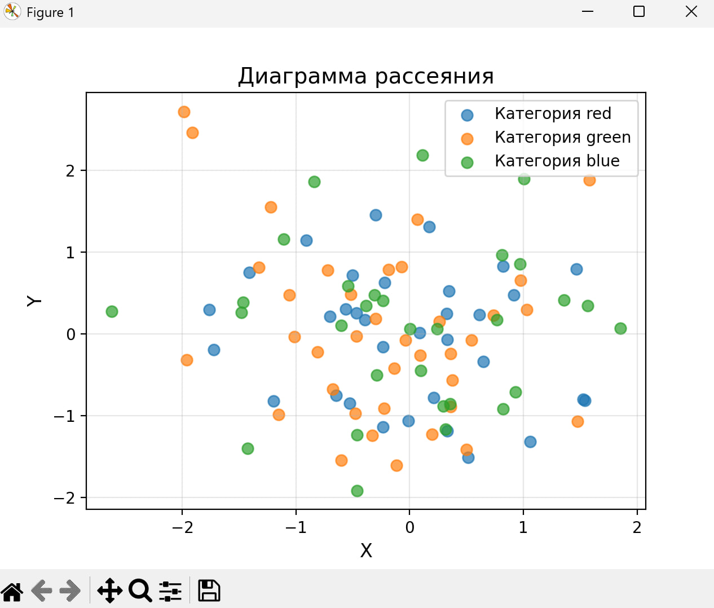
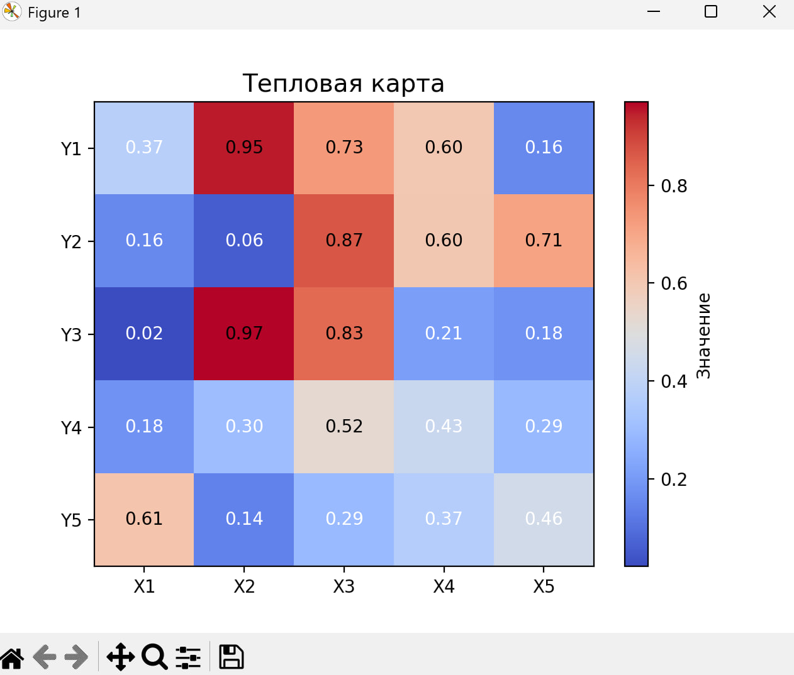

# Medium

## Описание задания

Постройте 4 графика с использованием seaborn вместо matplotlib

## описание работы

Основная логика построения графиков (на примере plot1.py)

Пример для заданий 1 и 2

```python
import matplotlib.pyplot as plt
import numpy as np

# 1. Генерация данных
np.random.seed(42)                    # Фиксируем случайные числа для воспроизводимости
x = np.linspace(0, 10, 50)            # Создаем 50 точек от 0 до 10
y = np.sin(x) + np.random.normal(0, 0.1, 50)

# 2. Построение графика
plt.plot(x, y, 'o-', markersize=4, linewidth=1, color='b')  # 'o-' = точки+линия

# 3. Настройка визуализации
plt.title('Линейный график', fontsize=14)   # Заголовок
plt.xlabel('x', fontsize=12)                # Подпись оси X
plt.ylabel('y', fontsize=12)                # Подпись оси Y
plt.grid(True, alpha=0.3)                   # Сетка с прозрачностью 30%

# 4. Отображение
plt.show()                                  
```

## результат работы программы

первый график

второй график

третий график

четвёртый график


## Список использованных источников

1. [MarkDown](https://doka.guide/tools/markdown/ "Документация по Mark Down")
2. [Python](https://docs.python.org/3/search.html?q= "Документация по Python")
3. [Readme example](https://github.com/still-coding/report_demo "Пример для оформления работы")
