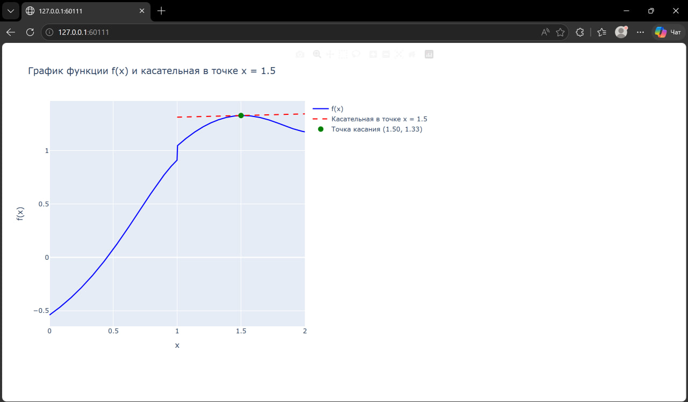

# Well-Done

## Описание задания

Создайте по заданию 3 с помощью Plotly интерактивный график,
доступный всем по ссылке

## описание работы

Программа строит интерактивный график кусочно-заданной функции и
касательной к ней в точке x = 1.5

```python
def f(x):
    mask1 = (x >= 0) & (x <= 1)
    result[mask1] = -np.cos(np.exp(x[mask1]))
    mask2 = (x > 1) & (x <= 2)
    result[mask2] = np.log(2 * x[mask2] + np.sin(x[mask2] ** 2))
```

Итог: На выходе получается HTML-файл с интерактивным графиком, где можно наводить на точки, масштабировать и взаимодействовать.

```python
pio.write_html(fig, 'interactive_graph.html')  # Сохраняем в HTML
fig.show()  # Открываем в браузере
```

## результат работы программы



## Список использованных источников

1. [MarkDown](https://doka.guide/tools/markdown/ "Документация по Mark Down")
2. [Python](https://docs.python.org/3/search.html?q= "Документация по Python")
3. [Readme example](https://github.com/still-coding/report_demo "Пример для оформления работы")
